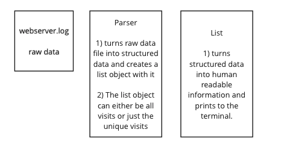

# ruby_parser_task
A short challenge set as a tech test

## How to use

### The feature
clone the repository, install the packages and run from the command line. You can use any log file of the same format.
```
$ git clone https://github.com/olliesmith3/ruby_parser_task.git
$ cd ruby_parser_task
$ bundle install
$ ruby ./lib/script.rb webserver.log   
```

### The tests
follow the above steps and then:
```
$ rspec  
```

## Plan

#### Requirements

Write a ruby script that:

a. Receives a log as argument (webserver.log is provided) e.g.: ./parser.rb webserver.log

b. Returns the following:
list of webpages with most page views ordered from most pages views to less page views e.g.:
/home 90 visits /index 80 visits etc... > list of webpages with most unique page views also ordered
e.g.:
/about/2 8 unique views /index 5 unique views etc...

#### My approach
The below diagram shows my plan for the two classes and their responsibilities that will be required to complete the task.



There are a lot of different ways to complete the challenge. My approach is to stick to object orientated principles and to try and make the code a clear as possible, easy to change and to follow a TDD approach. One option I considered was to just make one class which reads the file, formats the data and then prints it. However, I think using two classes separates the responsibilities of reading the file and formatting the output information which makes the code easier to understand and easier to add additional features in afterwards.

##### TDD
I am going to make a commit at every stage of the Red, Green, Refactor cycle. This is to give you a better insight into my TDD approach. In a proffessional environment I would only commit when the tests are passing.

##### Reading the file
Having a look at the different options of reading files in ruby, the most efficient seems to be the foreach method as it doesnt open the whole file into the memory at once. This should mean my solution is more scaleable to larger log files.

##### Storing the information into structured data
There are a lot of different ways to do this. As the order of the page visits is not important I will rule out an array of arrays. A hash with the page name as the key and the IP address as the value would not allow duplicates very easily so is not suited to this data. I think the best will be a hash with the page name as the key and an array of IP addresses as the value.

##### Formatting to human readable format
I have decided just to stick to the format provided in the instructions to stay in line with the brief.

##### Abstraction VS Mocking
I have noticed now that I have not mocked the list class in some of the Parser tests. To do this I would have to find another way of unit testing the create_list method. This could be done by making the read_logs method public. However that would then go against the OO principle of abstraction as read_logs is not a feature that the user needs to have access to. As the tests only rely on the initialize method of list and none of its more complicated methods which would be likely to change in the future, I think it is best that I leave them as they are. However, if this were a longer challenge I would try to find a way around this perhaps by restructuring the classes responsibilities.